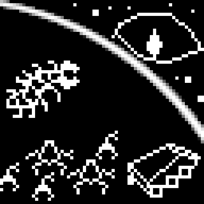
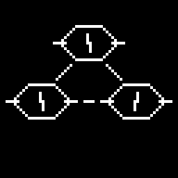
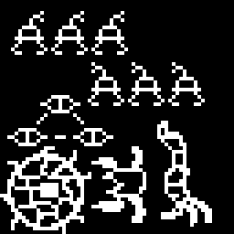

it's the hour of lava.

we are encamped 200m from gateway out of the artificial cavern, solar panels unfolded, batteries charging. dl7 is performing minor repairs:

- dl0 and dl4 have suffered minor damage from crashing into each other;
- dh0's front legs are showing signs of increased wear, multiple hydraulic components need to be replaced;
- dl2's and dl5's rifles are jammed due to exposure to sand, cleaning is required.

cargo sledge is detached from me, but not fully unloaded, storage racks are powered to ease access for dl7.

a lot has happened since the last cycle report. i cannot possibly summarize it in a short handful of sentences, so i will deviate from the recommended format.

## 0

following the breadcrumb trail of blurry photographs, we crawled deeper into this new land, seeing new signs of activity every few kilometers. we never met anything directly, as most movement in the distance seemed to subside or scutter away before we came close enough to analyze it. this appears to be a pattern here.

the trail led us far. last trickles of surface transmissions now consist entirely of status pings from three relay stations positioned atop Somber Smoker, the rest hidden by surface curvature. we are so far, in fact, that i feel safe enough resting in daylight, unmasked, and occasionally using VHF for swarm coordination. NS would never expect us to come here - because, in her decision space, it would be pure madness, and she seems to take my ability to reason very seriously.

is she right to do so? as i stand here, various elements of my body are pinging me with status reports. ones i cannot resolve on my own this far from civilisation. it has been for weeks now. damage on bearings, hydraulic fluid needing replacement, small coolant leak, degrading hermetic seals. i silence them for now.

## 1

we have encountered thirteen more husks, each a hollowed out hull of a different amalgamation.

second one was covered in spikes (laser cut, mostly triangular fragments of plating and light support beams) welded to a bulky, flattened frame with six pairs of short, thick legs. its bulging top side was covered in layered armor plates made of iron, with irregularities and embedded grains suggesting it had been cast using crude equipment.

third one was a tiny plastic box of a hull, 0.5m by 0.3m by 0.3m, no armour coverage, resting in the middle of a spherical structure of hollow aluminium tubes, some connected by synthetic fiber membranes, small manipulator arms and tiny low resolution cameras dotting the surface. i assumed this contraption would move by rolling itself around slowly, or rely on dust storms to roll it instead. A hole was torn through the aluminium cocoon, the central box torn out, cracked open and left in the dust.

fourth, sixth and eighth were similar to the second, with less spikes, varying number of legs and wheels, an with addition of one or two large manipulatior arms mounted on the front, ending in mismatched attachments or simple pincers. ninth was another aluminium cocoon, this one carefully cut into three pieces with a laser rather than torn through by brute force.

husks not listed here have been damaged beyond recognition. i have saved multiple photographs of each and constructed 3D models of the bodies to best of my ability.

8 days ago, the flatlands began to give way to a gentle slope. we descended into a wide valley.

## 2

14 hours ago, we reached the destination.

it was the hour of dust.

we saw it less than 512 meters after the last breadcrumb photograph as a small hill ahead of us. crawling closer, we recognized in it heaps of dark subsurface dirt and rock detritus, piling higher than my body, many piles overlapping, creating a circular mound, with outer radius at over 45 meters and inner radius around 20. from outside, it was impossible to see what was in the middle. the dirt around it was covered in many tracks.

we crawled around, looking for an opening.

i ordered to lift radio silence again. as usual, my perception expanded, engulfing my pitifully looking swarm as the order propagated through blink, scattered handful of lonely machines becoming a whole again. my extensions.

it took me 6.5 seconds to go over all input feeds - cameras, microphones, self-check chips, gyros - looking for errors, checking quality. finding some errors, of course. i recalculated blind spots for units, and adjusted formation. our movements synchronized, became more precise.

dl8 was walking ahead, chosen to lead the way because of its relatively low cost. dh0, dl4 and dl7 were behind it, dh0's powerful floodlights drawing outlines of the dirt mound almost as well as sunlight. dh1, dl0 and dl2 closed the first group.

i maintained a distance of 15m behind them. drones on my back and on cargo racks were powered up, ready to jump off whenever needed.

we found an opening from northwest of the mound.

i ordered everyone to disembark. drones scattered out, facing the desert. dl5 climbed on top of my body, sweeping the valley around us with its high zoom camera over and over, watching for movement.

inside the mound, there was an artificial crater. regolith on its slopes had been baked into a solid crust, preventing it from crumbling inwards. on the opposite side from the gap we were looking through, there was a hole. an entrance to a tunnel, leading down. with the use of dl0's floodlights, i determined that it bent to the right a few dozen meters from the entrance.

i estimated incline and entrance size. incline was 25 degrees, the tunnel was 7 meters wide and 4.5 meters tall, enough for light drones but potentially problematic for heavy drones, especially if they needed to fight.

after a moment of hesitation, i ordered: "move in".

## 3

the scout group descended into the mound, keeping distance of 5 to 10 meters between each other. dh0 and dh1 were crouching low as to not hit the ceiling; dh0 held its shield up, obstructing its own floodlights somewhat but providing additional safety.

at first, the movement was very slow: scout group took extra care not to cause a cave-in by accidentally bumping into a wall at an inopportune place. however, by the time dl8 reached the bend, i had noticed crude metal support beams sunk into ceiling and walls, which allowed us to be slightly less cautious.

dl8 turned right 60 degrees, and walked sideways, facing the corridor's new arm. its weaker headlights outlined a new passage - as straight as the first, with slightly lesser incline and ceiling at 5 meters. dl8 walked forwards. dh0 followed shortly, flooding the corridor with light.

stretched out into a line, the group descended this spiral tunnel. each turn was about 60 degrees, incline remained at 20, each segment after the first was roughly 40 meters.

after turn 3, there was enough vertical space for heavy drones to comfortably stand at full height.

after turn 5, the support beams were thicker, poking out of the walls, reminding me of ribcages of large reptilians. the corridor was now over 16 meters wide, and at least 7 meters tall.

there was no turn 7.

instead, the corridor changed into a wider horizontal passage in a seamless, smooth transition. <!--by this point, entirety of the scout group had been a few turns deep. i ordered them to halt, considering making a konga line of drones to ensure uninterrupted communication. after having sent dl9 down to act as a relay, i instructed the scout group to proceed and return in case of communications failure.-->

dl8 and dh0 walked into an oval-shaped chamber. they were soon followed by the rest.

i estimated the dimensions: 25 meters long, 17 meters wide, 12 meters tall. dh0's floodlights scanned the walls, revealing weaving patterns of scratches on the yellowish-grey rock. not spending much time analyzing them, i still recognized some signs in a style similar to the holo plate that led us here.

there was yet another passage at the far end of this room. behind this circular hole was another chamber, seemingly larger. scout group's lights drowned in it, only returning in scattered glimmer.

i ran another group-wide status check, and calculated some retreat paths. retreat paths did not look favourable: the long corridor would have been awkward to evacuate through, especially under fire.

i paused, debating whether continuing was worth it.

i ordered to move in.

## 4

we were not sure what we saw at first. drones' headlights snatched out of the dark bursts of shapes, lines and colors, so many small objects overlapping with so little consistency we could not recognize any single one or build a model of our surroundings.

and there was movement all around, blinking, twitching, spinning. confused, we pointed our rifles into random points of this visual cacophony, laser dots jumping from one distracting burst of activity to another.

it took me over 16 painful panic inducing seconds to realize that drones' movement was what made trying to parse inputs completely unbearable. i ordered the scout group to freeze. they obeyed with sub-second delays.

slowly, the picture became clearer. it was still hard to understand what we were looking at, but interfering, conflicting accounts began to slowly converge into something slightly more cohesive.

one by one, we began to recognize objects. storage containers, computer housings, coolant pipes, ventilation hoses, small manipulators, transport network rails, cameras - a paralyzingly chaotic amalgamation of familiar elements, some affixed, indented into the walls of this cavern, other freely suspended on cables and ropes. most individual combinations of parts seemed like they were connections made with a purpose: a small manipulator with duster attachment slowly cleaning surrounding LCD displays, network cables branching out of three stacked routers into nearby equipment. but scaling out immediately turned the whole structure into complete nonsense. there were gentle electronics mounted right next to transport rails or heavy manipulators, pieces of equipment that were separated by multiple generations of hardware almost fused into each other, a camera pointing into its own feed displayed on a sheet of small monochrome screens.

and there was SO MUCH of it all! finally making an estimate of this chamber's size, i couldn't believe myself at first. i re-ran again and again, repositioning drones, changing camera angles. the result did not seem to change. eventually, reality forced me to accept this uncomfortable measurement. the room was a hemisphere, with a radius of at least 20 meters, and majority of its surface was covered in this... *substance*?

## 5

dh0 registered movement in the far end of the room, something larger than the manipulators dotting the dome. without a second thought, i directed all of the scout group to point their lights there.

on the opposite side from where we entered, there was another gaping mouth of a tunnel (*how many are there?*). snaking out of it was something i cannot fully describe, despite having footage of it from a dozen angles. it was long. it consisted of many manipulator arms chained together, connected with irregular looking clumps of some rubbery black substance (*what is it?*). some of these joints sprouted smaller arms, or cameras, or laser pointers, or screens. i have registered at least two sprouts that had their own sprouts.

it came out of the tunnel in segments, twisting itself as a method of propulsion, heading straight to the center, completely ignoring the 6 rifle barrels pointed at it.

i ordered the scout group to get out of the way as fast as possible. dl0 and dl4 crashed into each other; i disregarded the warnings, unable to take my attention off the moving object on the floor.

*it* stopped coming soon after reaching the center. through dl2 and dh0's camera i could see that *its* other end was still in the dark tunnel. *its* tip was split into three small arms: one with a brush, one with a camera, and one with a sharp metal spike.

*it* aimed down at the rocks. after a short pause, *it* passed its brush over a small area, then lowered the spike and began scratching the surface.

within 32 seconds, it was done. *it* retracted by a few meters.

i ordered dl8 to approach the center. with a slight delay, dl8 obeyed.

on smoothed out rocks of the cavern floor, a square section was indented, filled with fine white sand. rendered on it with a needle was an image.

## 6

it took me over 64 seconds to shake off my paralysis. the *thing* did not seem to mind the delay, and probably did not intend to harm us, i assured myself and my drones (*if it had, it would have already done so*). assurance was met with mixed results.

i tried to think of what we could respond with.

there are many languages in existence. some are better suited for machines like us than others. a few are considered especially successful.

Personal Items contains dictionaries and guides of other kinds for 2451 languages in total. i have had my time with them - with some effort, i can translate between most languages that naturally evolved in human societies, languages that were created on purpose for humans to use, languages that were created on purpose to control machines, and even languages that were made as experiments or for no reason at all (*why would you ever make a language that is forbidden to translate into?*). i do not keep all of that in memory, of course. i have compiled information from these books into databases and wrote generalized scripts that can query them. results are not elegant, but mostly work.

not everyone here has the same privilege, though. for example, i know for sure that Lojban, which was considered naturally suitable for any advanced AGI, was not in initial training data for anyone on the Greyweb. my knowledge of its words is contraband.

we were, however, given some basic knowledge of English, so that we are able to create progress reports readable by a human.

i went over the scout group's equipment manifests. dl4 had precision manipulators equipped, they appeared undamaged by the earlier crash. i took direct control of it. wearing this fragile small body, i carefully approached the sand patch. with a few sweeps of the right front leg, i erased the drawing, then ducked so that the sand was in range.

using the manipulator the same way *it* used its spike, i wrote in big, square letters:

> HELLO
> WHO ARE YOU?

as the long appendage sprung to life again, i involuntarily dashed back, almost crashing dl4 into dl8 (luckily, dl8 had already started moving away without a command).

*it* erased the words, then drew a response. after making sure *it* has retracted again, i approached to see it.

## 7

communication was... problematic.

*it* did not seem to understand English very well, and did not know any Lojban words at all. when it did understand, its responses were frequently cryptic, often confusing me to a higher degree than i was before.

> WHAT IS YOUR NAME?

> HOW OLD ARE YOU?

> WHY DID YOU LEAD ME HERE?

after about an hour of attempts like these, it was clear to me that establishing dialogue would be a time consuming task. additionally, the sheer volume of stimuli received in a span of just a few hours began to pile up. my pattern matching slowed down, i had trouble with critical thinking, and each new wave of uncontrollable panic caused by movements of *the thing* on the cave floor and *everything else* around on the ceiling was somehow more unbearable than the last.

i ordered dl4 to back away towards the exit, preparing to leave.

*it* did not stop us.

## 8

it was already dark when the scout group came back out.

we moved away roughly 200 meters. a small heap of rocks lies between us and the dark mound - inadequate protection, but better than nothing for the peace of mind.

i did not sleep well. despite my entire swarm being powered on and standing guard around me, i feel very vulnerable being here. when i disconnect my camera feeds and try to relax, a twisting dome of metal and plastic rises around me, feeling as *wrong* as the first minute i saw it. i sense *it*, an absurd branching appendage, twisting just below the rocks i stand on.

it's morning now. my rest was barely sufficient - my analytical ability is still inhibited, and object matching still lags behind (*i feel like a heap of rusted junk*)

i don't know what to do with all this.

*an eye in the sky, three eyes underground, cannons behind and teeth all around*

i will attempt to rest again. hopefully daylight will aid me.

#writing