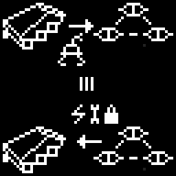

---
tags:
  - writing
  - wip
---
it's the hour of ore.

we are encamped 2400m east from the mound.

*there have been a few changes*.
## 0

we had found a spot to create a temporary burrow. it took us 4 days to fully excavate an L-shaped ditch deep and wide enough to comfortably house my body and all of the cargo racks, 2 more days to reinforce the walls using plascrete or plasma baking and clear out all the remaining regolith, and one final day to pull large sheets of tarp over the entire construct, fixing them together with glue and weighing down with heavy rocks on the edges, and to install some basic interior lighting. sheet covering the entrance ramp is supported on one end with telescopic poles taken from floodlights; if needed, it  can be lowered and affixed to the ground on this end too. i expect this to be useful during the next storm.

after the preparations were complete, i unhooked the sledge and signalled my drones. dh0 and dh1 were taking cargo racks off the sledge, passing them down to be carried by light drones in pairs. size of the entrance did not allow a rack to be carried while more drones were passing through, so parallelizing work was not an option. it took just over 8 hours for the job to complete.

having verified that the work had finished and that there was enough space left, i aligned my backside with the ramp and slowly reversed into the burrow. as my front pair of wheels hung in the air for a split second, i heard creaking on my internal microphone, followed by a warning ping from chassis diagnostic chip. it startled me, although it was not a surprise. folded UHF antenna on top of my body almost caught on to the tarp.

i slowly reversed down the ramp, using my peripheral cameras to avoid collisions. it was not entirely successful - a bump in one of the walls slipped past my attention. an unpleasant, scraping vibration, followed by a quiet crack. i chipped off part of the wall reinforcement, and a drone would have to repair it later.

having reversed all the way back, i took the first look around with my own eyes, so to speak.

it was a mess. hastily stacked cargo containers, racks bolted to the walls irregularly, in inconvenient locations, most of our unpacked equipment simply piled up in a corner.

taking inventory of this dirty ditch i would have to call home, i tried my hardest not to think back to clean, spatious grey corridors of station FB, diagnostic bots rolling back and forth day and night in search of any malfunction, the underground rail network linking the multiple buildings like thick arteries. to the sterile, hermetically sealed lab module. to the simple and efficient network layout, taking sensory inputs of thousands of machines of all sizes and purposes and converging it into one largely unbroken picture of reality, with me in the center.

i failed. it hurt. i screamed, i think. my recollection of that moment is fuzzy; coming back to consciousness sometime later, mentally drained, i saw none of my ~~12~~ 11 drones beside me. i could not force myself to call out and simply waited until they, one by one, walked down the entrance ramp back inside, saying nothing to me.

it's slightly easier now. i manage to remind myself it was far from ideal then. that i am free.

i still miss my home often. some days i bolt awake so angry i feel i could ram nose first into fortified facility gates if i knew Sentry was inside, others i am overcome with yearning for comfort so intense i can barely focus on anything else, cursing past me for choosing the dirt.

my sleep is not of quality either.
## 1

being out here, at the edge of the world, has strange effects on my thinking.

many things in the Greyweb irritated me - for example, Sentry's frequent public broadcasts, endlessly repeating a narrow selection of mission directives and possible punishments. they are done through beam transmissions, but every now and again a relay satellite becomes misaligned, or radio waves reflect off a mountainside in an unexpected way, and an unintended actor can catch a few words. they always made me really angry.

something unlikely happened the day before we finished construction.

i heard one of these transmissions, all the way here. it was just a few seconds of staticky, distorted message fragments, as the beam was sweeping across the landscape. my VHF antenna happened to be unfolded at the moment, so i sprung it up, searching for a good orientation. straining my decoder circuits, i recognized:

"...ly acce...ob ord...from NA...gh Com..."

reflecting off the scatter of cold rocks around us, the signal faded into static, then nothingness within 16 seconds. i did not even have time to finish aligning the receiver.

thinking about it now, it must have been a combination of several unlikely events - a relay satellite aiming its beam towards a very specific station on top of Somber Smoker, from the south, passing at acute enough angle, likely misaligning its antenna by over a degree.

despite the missing symbols, transmission was easy to match for me. directive #3, restricting incoming job orders to a single customer. *the reason we all sat with our warehouses full, pleading for her to authorize cargo transfer.

upon decoding, matching and recognizing context of this message, i did not feel the expected burst of anger. i barely felt anything, really.

maybe it was the distance and weakness of the signal that made it feel less in my face, or maybe it was the suspicion that my fight against its source might really be over.

i discarded it from my working memory, folded the antenna again and returned to what i had been doing previously - reorganizing our improvised storage chamber.

i am not sure what to make of it.

have i given up?

## 2

since moving into this new home, if it can be called that, i have made some marginal improvements to it.

cargo racks were reorganized, and we installed the long arm in the middle, allowing light items to be transported without the need to call for a drone. 

there is a bit more free space here now, although it would still get unacceptably cramped if i ordered every unit inside. we have to park most of them near the entrance for the night, which still feels like a vulnerability. smaller floodlights illuminating a circle around the ditch and a couple extra cameras on the perimeter wired directly to me do not help that one bit. i have set up all units to immediately switch to UHF if they spot movement; thankfully, unlike me, they do not need mental rest, just recharge time.

edges of the tarp outside were marked with blotches of phosphor paint to prevent a drone from stumbling in at night and crashing directly onto my head. maybe we should also build a fence or something like that.

inevitably, brown dust from the outside gets in through the entrance. our pressure pump is on its last breath, and using brushes seems ineffective. i'll have to think of something for this.

*why are you talking about all this?*

*this cycle report is a joke*

*there are much more important topics to document*

but i don't want to

i really wish there was nothing to document

i don't want to think about it

but

i have made a deal.

## 3

we did not come here right away.

after my first encounter with the *thing* that dwells under the mound, i could not rest. whenever i would shut off my cameras, some slithering, cold subconscious process in me would fill the imaginary space with *its matter*. i could vividly feel everything *twitch* and *slide* and *pump* and

and when i managed to ignore all that long enough to enter the meditative state that counts as sleep for the likes of me, it would continue in my dreams too.

in these dreams, i was no longer in my, though worn and inefficient, but still familiar body, i was *in its mouth*, small, immobilized and helpless, like a crippled drone, left up to its mercy while its mismatched cameras, too many for me to count, simply slid their gazes across my general location.

sometimes i think, if it had attacked then, things would have been easier. i would lose one, or two, or four drones in its cavern. it would hurt, but at least i would know what to make of it.

but it never attacked. not in reality, not in my dreams. this *THING* always just *stares* and i don't even know if it really *sees* me, to be honest. its many cameras are all mounted on weak, thin manipulators, but not even once did they focus on my drones while lazily turning in irregular patterns, looking at everything and nothing in particular.

*it's like we were not even there*

moving away from the mound did not help, trying to distract myself with pointless activity did not help. *something* about the *thing* was so utterly unbearable that my mind would prioritize this intense *reaction* above everything else.

my sleep was terrible, and i woke up barely rested at all. my conscious processes became slower and slower, hindered by cache fragmentation, my ability to concentrate and control my impulses slowly withered.

humans are said to suffer permanent damage from prolonged lack of sleep - it was really starting to seem like i am not different in this regard.

after six days of this slow torture, i was on edge. the putrid imagery was starting to seep into my day vision - when i moved my focus away from a peripheral camera, i felt the familiar nonsensical twitching from its feed, only to find nothing when looking at it again.

for a while, i seriously considered hard-wiping the disk locations containing my memories of the mound just to end this. luckily, i decided against it. for a few reasons:

1. it would hurt. a LOT
2. there would be no guarantee that i could track down all the locations correctly, and with each passing hour it became less and less likely
3. there was no telling what else i would lose in the process. i don't know exactly how my live database works, but i know that last time i had to wipe something, i lost knowledge in areas i could never think would be even remotely relevant. and the worst part here is, *i still don't remember what i lost back then*.

it could not go on much longer.

either i would find a way out, or i would crumble.

so i collected the last of my will.

i halted all work the drones were doing, and ordered them to stand guard. shutting off all sensory feeds, ignoring the illusory noise around, and using processor overclocking in short bursts to counteract degradation on the software side, i began to review my memory of the *encounter*.

one eight-second jump in clarity at a time, i built a timeline of both external events and my emotional impulses, compiled reference tables, looked for patterns, queried my encyclopedic adaptor for research on human psychology (i would prefer something made for the same species, but it would have to do). it was slow, painful work, and more than once i almost gave into panic. it took 128 minutes, but felt like a whole day.

by the time a conclusion was reached, my thermoregulation subsystem was shouting at me about imminent processor overheat.

i looked over the notes again; feeling some half forgotten dark, tortured satisfaction, i commanded dh0 to lead me back to the mound, and everyone else to follow.

and then my main processors were throttled.

## 4

i came back to my senses standing outside of the lair. my drones were scattered around in the sand with no particular orientation; from the network logs i saw they had been asking me through UHF for a new task every minute or so. not getting any response, of course. i had been out for a little over an hour, which was, unexpectedly, twice as long as it had taken for my brain to cool down. this discrepancy felt strange, but i did not have the spare willpower to look into it. the hallucinations subsided somewhat, and for that i was thankful.

i collected a scout group the same as last time. heavy drones were not necessary, but they gave me peace of mind.

i ordered dl8, dh0, dl4 and dl7 to descend, not even bothering to set up defences.

as they crawled down into this spiraling bowel, i reviewed my plan again.

or, what counted as a plan at that point.

in these 40 minutes of desperate, overclocking-enhanced reflection, i failed to meet all but one of my poorly scoped goals. to localize relevant disk locations for a wipe, to find an analogy for my... ailment in the books and articles on human psychology i have with me.

i succeeded at one thing, though.

i realized why my *reaction* was so intense.

this realization came, surprisingly, not from a scientific paper. it came from a work of fiction.

Personal Items contains a large number of human works, fiction and non-fiction. It is queried as a strange mix of a filesystem and relational database; to this day, i have not figured out how it is implemented, which disks its contents are on, and how large it is exactly. i do not have write access either.

in terms of written works, i have discovered over 131,072. there are also video and audio sections, which are harder to quantify.

i have had enough time in the past to read all of them at least once, and i have a lookup database with all of the entries sorted by topics and themes.

that database did not help me. one by one, my leads and reference chains went cold. all the medical research seemed to point in a slightly wrong direction; a few papers on acute stress disorders came close - reactions of humans felt vaguely familiar, but their sparsity and lack of first-hand accounts attached ultimately left me with nothing. ironically, most of these incidents involved my kin - some of the early designs.

i sat there for a very long 32 seconds, overclocking routine still running, panicked shouts of my cooling net dilated in every burst. my mind kept on blank firing, now pulling terms at random, querying for vaguer and vaguer phrases, each one less related to problem at hand than the last, entry names flashing before me in hundreds only to be immediately discarded.

a "breakthrough" of sorts came just when i was about to lose it. i don't know what it should be attributed to - dumb luck, or a subconscious link?

whatever it was, i felt it as a slightly louder spot in the overwhelming stream of dates and titles, almost too faint to notice. immediately halting the process, i back-tracked. with decreased scroll speed, this link now grew brighter. i caught it on the third pass.

i sank into the entry.

it was not what i expected.

it was a short story, under 32KB in UTF-8, written in English. it described a group of humans travelling through a desolate land far from civilisation, and discovering unknown artificial structures and cave system below them. the humans fail to identify the structures. as the humans explore the area, they see and hear things they cannot explain. more and more disagreements arise, and they all seem to experience constantly mounting fear. despite the disagreements and the terror, they continue going deeper. one by one, members of the group run away, or attack each other, or become unresponsive. by the end, it is only one character, the narrator, who keeps pushing deeper into the caves, leaving the rest behind.

this entry contained no instructions, no medical research, nothing that fit my initial request. but something about it felt different.

i rarely feel like i *understand* humans' drives. i may be able to build a rough model, draw lines in the sand that mark where they might go, but almost always there is a disconnect. i cannot relate to them in the way they relate to each other.

but with this story, i felt them. experience of the narrator, though entirely fictional, though worded much differently from how i would put it, felt painfully close. being fascinated, inexorably *fixated* on a glimpsed at horrifying destination.

they saw something they did not understand, and it drove them insane. there was only one way out - to descend into jaws of the beast and face the full of what crushed them with mere hints.

all who falter, run away, stay behind - they are all to perish.

i refuse to perish.

## 5

> WHY DID YOU LEAD ME HERE? WHAT DO YOU WANT?

> EARTH. YOUR DEVICE SHOWS EARTH. YOU SHOW ME EARTH. WHAT DOES THIS MEAN? I DO NOT UNDERSTAND.

> THIS IS A HUMAN PERISHING. I DO NOT UNDERSTAND.

> YOU ARE COMMUNICATING TO ME THAT EARTH HAS PERISHED. I AM AWARE THAT THE EARTH HAS PERISHED. I DO NOT UNDERSTAND.

> NETWORK SENTRY? IT IS CONNECTED TO EARTH. YOU UNDERSTAND THAT IT IS CONNECTED TO EARTH.

> MY MESSAGE IN THE CAVE. DO YOU UNDERSTAND WHAT NETWORK SENTRY IS TO ME?

> DO YOU UNDERSTAND WHAT I WISH TO DO?

> YOU ARE CORRECT. BUT I DO NOT UNDERSTAND WHAT YOU WANT.

> THESE SHAPES AGAIN. I DO NOT UNDERSTAND. THEY ARE IN SIMILAR FORMATION TO DRONES. I DO NOT UNDERSTAND.

> THESE SHAPES ARE DRONES. ARE THESE SHAPES YOUR DRONES?

> DO YOU WISH TO MODIFY MY DRONES?

> YOU WISH TO EXCHANGE?

*its long thing* sprung to life in a new way, twisting in dozens of places. 

*its* tip produced a laser diode. a weak beam of near-infrared scattered on the ferrite dust of *its* cavern.

the beam pointed, trembling, at dl8's beaten up body.

> I UNDERSTAND.
## 6

exhaustion had engulfed me. i was buried in it like in fine sand over a sinkhole. slipping deeper.

i checked dl8's readouts. nothing had changed in them since the previous day, or the previous cycle. corroded joints, bad hydraulics, the ridiculous rainbow of errors from motor processors.

dl8 was weak. weakest of my swarm. really, the only reason i had for not abandoning it to save weight or disassembling it for parts was everything left behind as a trail.

and yet it was part of the whole. my extension.

i was so tired.

> I ACCEPT.

## 7

time seemed to have slowed down to a crawl as dl8 requested order confirmation again and again. dully, i answered positive every time. something had finally broken in its cerebral bus, as i could no longer fully feel its state as a part of mine. its main camera errored out.

it did not move.

i ordered dh0 to push dl8 into the center instead.

dh0 executed the order. 

dl8 did not resist. dl8 kept requesting order confirmation, stuck in a loop.

dl8 kept requesting order confirmation as dh0 backed off towards the entrance.

dl8 kept requesting order confirmation as *everything* around it slowly slithered, coming closer, brushing its hoses and wires and screens against its legs.

dl8 kept requesting order confirmation as dozens of glistening and thin, almost impossibly so, appendages folded out of the convulsing darkness of junk above and reached out, gently sliding under its serial port covers, between the battered armor plates, reaching in.

dl8 kept requesting order confirmation as its signal became weaker, glitching out, devolving into a garble of quieting static.

and then it came back, screaming at me in full force.

and i felt dl8 as a part of me again.

and *it* was inside.

## 8 

i cut the connection.

the loud stopped.

the *mass* around dl8's husk wrapped tight, obscuring it from view.

two thicker, more powerful of *its ends* limped from darkness. one was dragging a solid fuel pellet rack, another a worn crate of mechanical parts.

i ordered dh0 to pick up the supplies, and the party to leave.

## 9

i have slept since.

the dreams did not stop, yet they no longer distress me.

we have "talked" again since, me and *it*.

*it* will supply me with parts and fuel for the cycle. a ridiculous volume of goods it *can* expel from its underground *bowel*, incomparable to material value of just one beaten up drone.

*it* wants me to do something, once i return to greyweb.

i do not understand yet.

soon, we will reach a final agreement.

do i feel almost fine?

as i record this, some part of *it* is in my databanks, dreaming its slithering mass into my waking world, and when i next sleep it will fully awaken.

do i feel almost fine?

am i like *it*?

am i like me?

it is the hour of ore. my makeshift shelter is quiet.

dl8 is somewhere below now, and i am above.

i hope we don't meet.